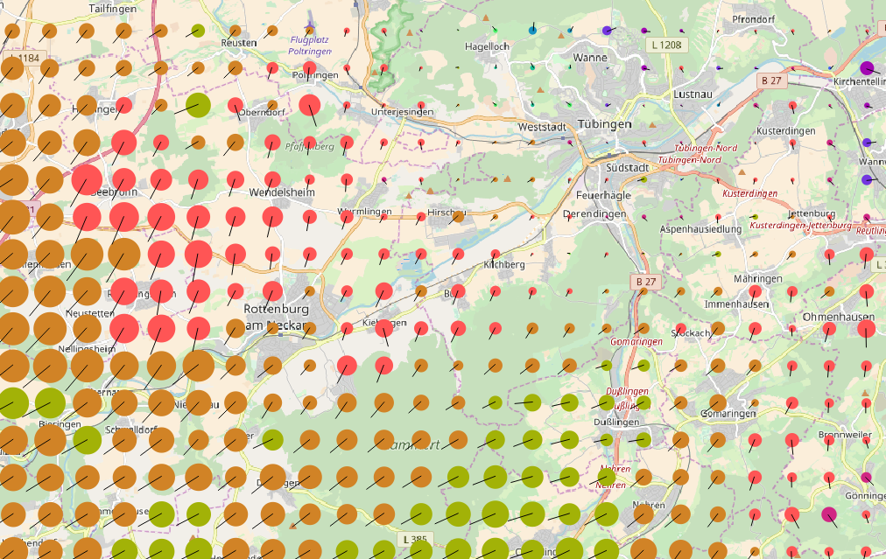
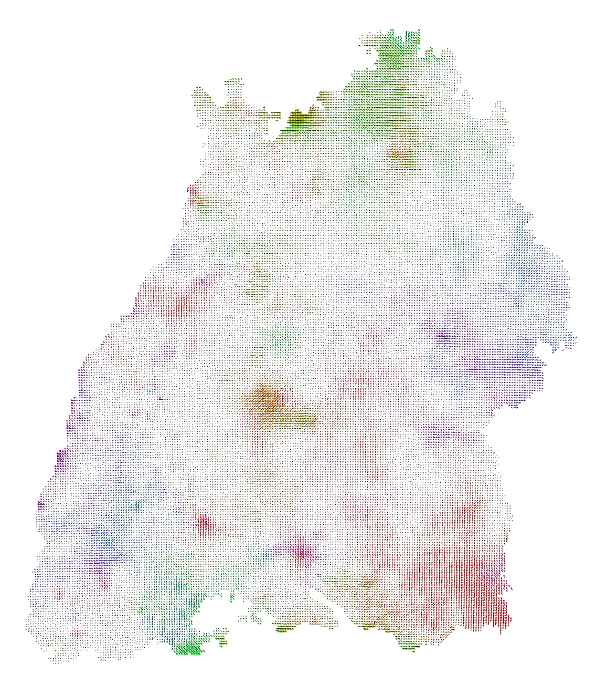

# BWTA2017 transformation

BWTA2017 is the new NTv2 grid for transformation between Gauß-Krüger and UTM in Baden-Württemberg.

The transformation is published as open data (License: https://www.govdata.de/dl-de/by-2-0) by the [LGL (Landesamt für Geoinformation und Landentwicklung)](https://www.lgl-bw.de). 
To download and for further information (mostly in German), see:

* [LGL: ETRS89-UTM](https://www.lgl-bw.de/lgl-internet/opencms/de/05_Geoinformation/Liegenschaftskataster/ETRS89-UTM/) - Baden-Württembergischer Transformationsansatz für ALKIS 2017
* Download [BWTA2017.zip](https://www.lgl-bw.de/export/sites/lgl/unsere-themen/Geoinformation/Galerien/Dokumente/BWTA2017.zip)

Computations are based on data of LGL, [www.lgl-bw.de](http://www.lgl-bw.de) (Datengrundlage: LGL, www.lgl-bw.de)

If you wan to include it in QGIS, see this detailed explanation (in german) and replace BETA2007 accordingly: [Praezise_Transformation_im_QGIS_mit_Batchmodus.pdf](http://www.gkg-kassel.de/pdf/Praezise_Transformation_im_QGIS_mit_Batchmodus.pdf)

To show the differences in the transformations [BETA2007](http://crs.bkg.bund.de/crseu/crs/descrtrans/BeTA/de_dhdn2etrs_beta.php) and BWTA2017, a grid with distances of 1km was created and transformed.

* bw_grid_1km_000.utm original grid in UTM coordinates, within the polygon of the [open data set of Baden-Württemberg](https://www.lgl-bw.de/lgl-internet/opencms/de/07_Produkte_und_Dienstleistungen/Open_Data_Initiative/index.html): [Landesgrenze (ZIP-Archiv mit SHAPE-Dateien, ETRS89/UTM, Stand 12.2017)](https://www.lgl-bw.de/lgl-internet/web/sites/default/de/07_Produkte_und_Dienstleistungen/Open_Data_Initiative/Galerien/Dokumente/AX_Gebiet_Bundesland.zip) (data source = Datenquelle: LGL, www.lgl-bw.de).
* bw_grid_1km_000.etrs89.zip ETRS89 geographical coordinates (from UTM)
* bw_grid_1km_000.etrs89_via_BWTA2017_to_gk3.zip (Gauß-Krüger zone 3 \[GK3\] coordinates from ETRS89 geographical coordinates), transformation grid BWTA2017
* bw_grid_1km_000.etrs89_via_BWTA2017_to_gk3_via_BETA2007_to_etrs89.zip (ETRS89 from GK3), transormation grid BETA2007
* bw_grid_1km_000.utm.offset.zip UTM coordinate differences, see attributes for UTM coordinates and differences `diffr=$x-"field_1"`, `diffh=$y-"field_2"`

Transformations were computed with ogr2ogr and the bash script `tf_beta2007.sh` included in this repository. For reference and reusage, the resulting ogr2ogr commands used were:

`ogr2ogr -s_srs EPSG:4258 -t_srs '+proj=tmerc +lat_0 =0 +lon_0=9 +x_0=3500000 +y_0=0 +k=1.000000 +ellps=bessel +units=m +nadgrids=/usr/share/proj/BWTA2017.gsb +wktext ' -f 'ESRI Shapefile' bw_grid_1km_000.etrs89_via_BWTA2017_to_gk3.shp bw_grid_1km_000.etrs89.shp`

`ogr2ogr -s_srs '+proj=tmerc +lat_0 =0 +lon_0=9 +x_0=3500000 +y_0=0 +k=1.000000 +ellps=bessel +units=m +nadgrids=/usr/share/proj/BETA2007.gsb +wktext ' -t_srs EPSG:4258 -f 'ESRI Shapefile' bw_grid_1km_000.etrs89_via_BWTA2017_to_gk3_via_BETA2007_to_etrs89.shp bw_grid_1km_000.etrs89_via_BWTA2017_to_gk3.shp`

A QGIS project was used for the visualisation: [bw_grid000.qgs](bw_grid000.qgs). 
The project contains a Map for PDF (and other file type) exports.

Differences between Transformations visualised\
BETA2007 (Germany) - BWTA2017 (Baden-Württemberg)
* plotted at grid points of 1km distance
* dot color denotes direction
* dot size the difference (1km diameter ~ 100mm)
* lines: length and direction denote destortion

The files and images are licensed: BETA2007 - BWTA2017 differences by 
[github/Marwe](https://github.com/Marwe/bwta2017data)
is licensed under a  
[Creative Commons Attribution 4.0 International License ](http://creativecommons.org/licenses/by/4.0/)

